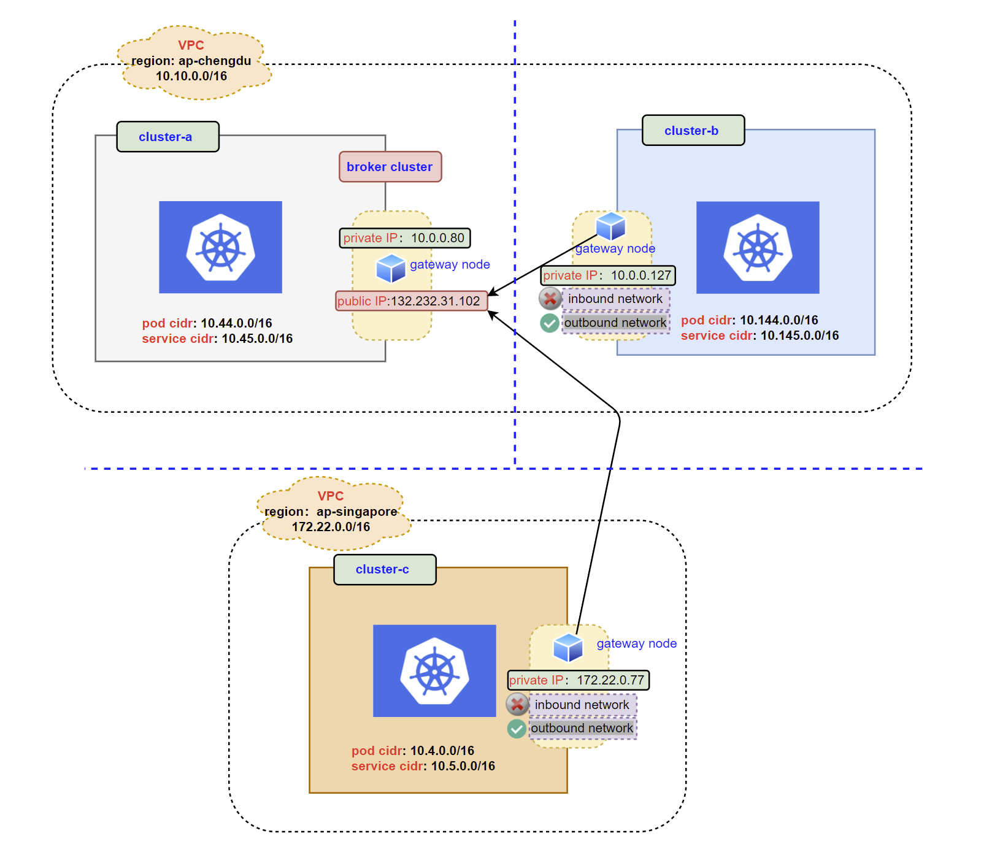

# 多集群通信方案设计文档

Kubernetes 实现了网络虚拟化，让容器可以在同一集群中的多个节点运行并相互通信。然而，在不同的 Kubernetes 集群中运行的容器并不能互相通信。一个集群的 Pod 不能直接访问立一个集群的 Servcie，为了实现不同集群 Pod <--> Pod， Pod --> Service 的访问，我们需要一种跨集群网络互通的解决方案。

## 设计目标

- 多集群之间 pod 与 pod 互通
- 多集群之间 pod 与 service 的连接
- 适配不同云厂商
- 适配常见的网络 CNI 插件
- 允许通过云原生的方式部署，创建自定义资源 CR 就可以快速在多集群之间部署

## 开源选择 Sumariner

Submariner 是由 Rancher 开源的跨集群网络互通解决方案，通过创建了 IPSec 隧道和路径，使不同的 Kubernetes 集群中的容器能够直接连接。

主要功能：

- 与现有集群的兼容性和连接性：用户可以将 Submariner 部署到已有的 Kubernetes 集群中，并在位于不同集群的节点之间添加三层网络连接。
- 安全路径： 使用 IPSec 隧道实现加密的网络连接。
- 集中式代理 ：用户可以注册和维护一组健康的网关节点。通过 `Gateway` 组件实现
- 全局私有网络：使用全局虚拟网络解决多集群网络 overlapping CIDRs 的问题。通过 `Globalnet` 组件实现
- 服务发现： Submariner 提供跨多个 Kubernetes 集群的服务发现, 通过 `Lighthouse` 组件实现。
- CNI 兼容性： 适用于流行的 CNI 驱动程序。

## Operator 实现

通过 Operator 的形式部署 Submariner, operator 将会被部署在每个集群

- 部署 `broker`: 创建 `Fabric` CR, 并配置 `brokerConfig`
- 部署 `join`: 创建 `Fabric` CR, 并配置 `joinConfig`


### 架构

<div align="center">
    
</div>

### 功能

- 自动发现不同 Kubernetes 提供商 (aws, gcp)， 预先配置 Submariner 依赖端口
- 允许自定义安装 Submariner 相关组件，`Globalnet`, `Lighthouse`
- 适配现有常见的的网络 CNI 插件，如 generic, Canal, Weave-net, OpenshiftSDN, OVNKubernetes, Flannel 和 Calico。

### API 定义

此 Operator 只有一个 CRD `Fabric`，Submariner 的 deploy，join，prepare cloud 都是通过一个 CR 完成，CR 当中主要包含3部分的配置：`brokerConfig`, `joinConfig` 和 `cloudPrepareConfig`。

```go
type FabricSpec struct {
	// INSERT ADDITIONAL SPEC FIELDS - desired state of cluster
	// Important: Run "make" to regenerate code after modifying this file

	// BrokerConfig represents the broker cluster configuration of the Submariner.
	// +optional
	BrokerConfig `json:"brokerConfig,omitempty"`

	// JoinConfig represents the managed cluster join configuration of the Submariner.
	// +optional
	JoinConfig `json:"joinConfig,omitempty"`

	// CloudPrepareConfig represents the prepare config for the cloud vendor.
	// +optional
	CloudPrepareConfig `json:"cloudPrepareConfig,omitempty"`
}
```

API定义：
```yaml
apiVersion: operator.tkestack.io/v1alpha1
kind: Fabric
```

### 部署 Submariner broker, 创建下面的资源

```yaml
apiVersion: operator.tkestack.io/v1alpha1
kind: Fabric
metadata:
  name: deploy-broker-sample
  namespace: default
spec:
  brokerConfig:
    defaultGlobalnetClusterSize: 65336
    globalnetCIDRRange: 242.0.0.0/16
    globalnetEnable: false
    serviceDiscoveryEnabled: true
```

当上面的资源创建成功后，会输出一个 `submariner-broker-info` 的 ConfigMap，这个 ConfigMap 信息主要是给其它集群加入 broker 用的。

### 添加集群到 Submariner Broker

添加集群需要部署2个资源，`submariner-broker-info` ConfigMap 和 join broker CR

`submariner-broker-info` 的信息在 broker 集群的 ConfigMap 中可以查到: `kubectl get cm submariner-broker-info -oyaml`

```yaml
apiVersion: v1
data:
  brokerInfo: eyJicm9rZXJVUkwiOiJodHRwczovL2Nscy1tZGwzd240Ni1rdWJlbGIuY3EuMTI1MTcwNzc5NS5jbGIubXlxY2xvdWQuY29tIiwiY2xpZW50VG9rZW4iOnsia2luZCI6IlNlY3JldCIsImFwaVZlcnNpb24iOiJ2MSIsIm1ldGFkYXRhIjp7Im5hbWUiOiJzdWJtYXJpbmVyLWs4cy1icm9rZXItYWRtaW4tdG9rZW4tbjU0Zm0iLCJuYW1lc3BhY2UiOiJzdWJtYXJpbmVyLWs4cy1icm9rZXIiLCJzZWxmTGluayI6Ii9hcGkvdjEvbmFtZXNwYWNlcy9zdWJtYXJpbmVyLWs4cy1icm9rZXIvc2VjcmV0cy9zdWJtYXJpbmVyLWs4cy1icm9rZXItYWRtaW4tdG9rZW4tbjU0Zm0iLCJ1aWQiOiJjZDBkNGY2MC0wOTg4LTQ1MTktYmY4Ni0xMTZhNTVlZWI5MDciLCJyZXNvdXJjZVZlcnNpb24iOiI0NzEwNzUyNyIsImNyZWF0aW9uVGltZXN0YW1wIjoiMjAyMS0wNy0wNFQxMjowNjoxNloiLCJhbm5vdGF0aW9ucyI6eyJrdWJlcm5ldGVzLmlvL3NlcnZpY2UtYWNjb3VudC5uYW1lIjoic3VibWFyaW5lci1rOHMtYnJva2VyLWFkbWluIiwia3ViZXJuZXRlcy5pby9zZXJ2aWNlLWFjY291bnQudWlkIjoiMGU3N2FlMTctOWUxNi00NDNjLWI1ZWYtZDg0YTExN2Y0YjA5In0sIm1hbmFnZWRGaWVsZHMiOlt7Im1hbmFnZXIiOiJrdWJlLWNvbnRyb2xsZXItbWFuYWdlciIsIm9wZXJhdGlvbiI6IlVwZGF0ZSIsImFwaVZlcnNpb24iOiJ2MSIsInRpbWUiOiIyMDIxLTA3LTA0VDEyOjA2OjE2WiIsImZpZWxkc1R5cGUiOiJGaWVsZHNWMSIsImZpZWxkc1YxIjp7ImY6ZGF0YSI6eyIuIjp7fSwiZjpjYS5jcnQiOnt9LCJmOm5hbWVzcGFjZSI6e30sImY6dG9rZW4iOnt9fSwiZjptZXRhZGF0YSI6eyJmOmFubm90YXRpb25zIjp7Ii4iOnt9LCJmOmt1YmVybmV0ZXMuaW8vc2VydmljZS1hY2NvdW50Lm5hbWUiOnt9LCJmOmt1YmVybmV0ZXMuaW8vc2VydmljZS1hY2NvdW50LnVpZCI6e319fSwiZjp0eXBlIjp7fX19XX0sImRhdGEiOnsiY2EuY3J0IjoiTFMwdExTMUNSVWRKVGlCRFJWSlVTVVpKUTBGVVJTMHRMUzB0Q2sxSlNVUmFSRU5EUVd0NVowRjNTVUpCWjBsSldVbHVOMGxZYmpWeEt6UjNSRkZaU2t0dldrbG9kbU5PUVZGRlRFSlJRWGRWUkVWTVRVRnJSMEV4VlVVS1FtaE5RMUV3TkhoTGFrRlNRbWRPVmtKQmIxUkRibEpzWW0xT2JHSnVValZrVnpSM1JsRlpSRlpSVVV0RmR6VjZaVmhPTUZwWE1EWmlWMFo2WkVkV2VRcGpla1ZXVFVKTlIwRXhWVVZCZUUxTldUSjRla3hYTVd0aVJFNHpZbXBSTWsxQ05GaEVWRWw0VFVSTmVFNVVRWHBOYWsxM1QxWnZXRVJVVVhoTlJFMTRDazVVUVhwTmFrMTNUMVp2ZDFWRVJVeE5RV3RIUVRGVlJVSm9UVU5STURSNFMycEJVa0puVGxaQ1FXOVVRMjVTYkdKdFRteGlibEkxWkZjMGQwWlJXVVFLVmxGUlMwVjNOWHBsV0U0d1dsY3dObUpYUm5wa1IxWjVZM3BGVmsxQ1RVZEJNVlZGUVhoTlRWa3llSHBNVnpGcllrUk9NMkpxVVRKTlNVbENTV3BCVGdwQ1oydHhhR3RwUnpsM01FSkJVVVZHUVVGUFEwRlJPRUZOU1VsQ1EyZExRMEZSUlVFeUswVnNTMEZ1VVhVeVZqbHdXaTlNZUVsMlozbHNjazVsWnpaSkNsRnlkalJZYldWQ1NUQkRPREkxZUZKRVUwUkJiVkIwYjJKck5rUkRNVU5NV1VaM1JVTlJPRVpSZG5WTlJHUjVkRXgwTTJGS2NuQTNTRkpEYkhFd1ZWa0taMGxHTldwM2RrUXlRbkJGUkc4MGFYcFBNMlpMUTNkMGNWQlhRMGxvTlVSNE5XZG9XbFZQVTFZcmJHUXhNbmhoTm1GMk1HUnpjV0pqTVdWa1MwaEdlQXBpWTB0dk1WUm9TRWN4VjFaR2VDOU9TMlI0U0VkYWNFRkRiWEZDTm1kRmNVUmFRMkZUUlZKMmJWZFhPSHBaY25aa1MwbFhTRVZRVGtSdFJWZDJOV2hOQ21KQlRuWTFSbGhHTnk4MFJtUXZlRVpWTVdneFprSjVPQ3R5YlRkMVdDOHhibnBYUXk5NVZXUkxSV2hKTTAxTmVtMWxiWG94VkhJMFlsRXJTV0Y0WTA0S1ltSlNWVEpMTUVGUmFEWkJRbXRVVUZvNFlsbHZNbmxRVEZaYUt6WllPRE5OY2tOVlIyYzBUR2RCUm1WdmJIUkJibk5YZDNwcFNXUjJkMGxFUVZGQlFncHZNRWwzVVVSQlQwSm5UbFpJVVRoQ1FXWTRSVUpCVFVOQmIxRjNTRkZaUkZaU01HeENRbGwzUmtGWlNVdDNXVUpDVVZWSVFYZEpSME5EYzBkQlVWVkdDa0ozVFVKTlFUaEhRVEZWWkVWM1JVSXZkMUZHVFVGTlFrRm1PSGRFVVZsS1MyOWFTV2gyWTA1QlVVVk1RbEZCUkdkblJVSkJUVzFHWjB4MGVsQmtNa01LTHpsalVIa3lXbll2TnpaeWJGTjNjVTlOTlVwVlYyNTVaWGR4TDA5MllXRlhkV2RVUXpKQ05FaHJkMmcwVVd4bWJuQmlabXhCV1VwRmVHRnVja1l5TndwNWFXaGpWMEZXWjNvdlYyMWhSMW93VURFdlR6SnVUMlZUV2pkRFdFMU9hRFYxVDNwc09FUlNWQzg1WWxoRVQwRTRRbk5SZFdsVldFOVdNRXh4WlU1b0NqTlZRV2MxZVZka2VWcERZMGxpY0RoS05EVnlVMFJJU1ZsdU9FOWtXR2xXYWtWTlVUQk9ZM1pLVDNvNGIySmlhRTV2TVRkb2FsYzBNbXBGUjJablpFOEtiM000VFZweFdqVkhlbGR0U3pneVV6ZERaRUZYVjNFdlJtaFNNMlJtVFVrcmVGaHFTMDFpTVVsUVpEWkdaa3RCYlZRMlZ5dFdWRGRaYkVSaVZEWXZPUXBvVERaV1ZFZEZOemRhT0ZSeksxaHBaa051YlVaaU0ycHZRa2xhVm05cmRrcHNVWGx4WlRCMFJrdE5TWGxDTVVseVprUXZSSFExWjNVMmJqaHFTREpKQ2xaWVkwSllabGRxV2xsRlBRb3RMUzB0TFVWT1JDQkRSVkpVU1VaSlEwRlVSUzB0TFMwdENnPT0iLCJuYW1lc3BhY2UiOiJjM1ZpYldGeWFXNWxjaTFyT0hNdFluSnZhMlZ5IiwidG9rZW4iOiJaWGxLYUdKSFkybFBhVXBUVlhwSk1VNXBTWE5KYlhSd1drTkpOa2x0VWpCVE0yeHVUa1U1UmxkR09VdE9WV3hNVVRCNE5WcFVSakppTUhoellVVm9iVm96WkV0TVZVNW1WRE5PYUZKVmVGZE5NSEF5VlROTmFXWlJMbVY1U25Cak0wMXBUMmxLY21SWFNteGpiVFZzWkVkV2Vrd3pUbXhqYmxwd1dUSldhRmt5VG5aa1Z6VXdTV2wzYVdFelZtbGFXRXAxV2xoU2JHTjVOWEJpZVRsNldsaEtNbUZYVG14WlYwNXFZak5XZFdSRE9YVlpWekZzWXpOQ2FGa3lWV2xQYVVwNlpGZEtkRmxZU25CaWJWWjVURmR6TkdONU1XbGpiVGx5V2xoSmFVeERTbkprVjBwc1kyMDFiR1JIVm5wTWJXeDJURE5PYkdOdVduQlpNbFpvV1RKT2RtUlhOVEJNTTA1c1dUTktiR1JETlhWWlZ6RnNTV3B2YVdNelZtbGlWMFo1WVZjMWJHTnBNWEpQU0UxMFdXNUtkbUV5Vm5sTVYwWnJZbGRzZFV4WVVuWmhNbFoxVEZjME1VNUhXblJKYVhkcFlUTldhVnBZU25WYVdGSnNZM2sxY0dKNU9YcGFXRW95WVZkT2JGbFhUbXBpTTFaMVpFTTVlbHBZU2pKaFYwNXNURmRHYWxreU9URmlibEYxWW0xR2RGcFRTVFpKYms0eFdXMHhhR050YkhWYVdFbDBZWHBvZWt4WFNubGlNblJzWTJreGFGcEhNWEJpYVVselNXMTBNVmx0Vm5saWJWWXdXbGhOZFdGWE9IWmpNbFo1Wkcxc2FscFhSbXBaTWpreFltNVJkbU15Vm5sa2JXeHFXbE14YUZreVRuWmtWelV3VEc1V2NGcERTVFpKYWtKc1RucGthRnBVUlROTVZHeHNUVlJaZEU1RVVYcFplVEZwVGxkV2JVeFhVVFJPUjBWNFRWUmtiVTVIU1hkUFUwbHpTVzVPTVZscFNUWkpiazQxWXpOU2JHSlVjSHBhV0VveVlWZE9iRmxYVG1waU0xWjFaRVJ3ZW1SWFNuUlpXRXB3WW0xV2VVeFhjelJqZVRGcFkyMDVjbHBZU1Raak0xWnBZbGRHZVdGWE5XeGphVEZ5VDBoTmRGbHVTblpoTWxaNVRGZEdhMkpYYkhWSmJqQXVkMVkzYTBSNVdqUjJYMUJHUW0xSGRHUkdSMlJaUmpaTWF6UkJRM04wZVU1cVJVWnZhV1puWWxWbFRHVmtkRTVpYnpoU1JISTRWbU5EVEROdU0xVXdXVnBhTmtsUFYySkVNR295ZDJSdlNtaElhV0ZDYVU1ZlZFSnRlR0UyTUZOQlJEVmxaRUV3Y0hBd1pXZDRTMVZ0VVVSdVFUTlRNelIwU2xkQ09YaE1kakJYVVRCMWFXRkxSalJCZEZBM1FYSlNMVXBCUzNOS2NVTk9ZM0oxTVhoUGVrczBPRk5xV1dGWlEzQXpNVzlVT0UxWmRHZ3hiVmswWmxVMFptSkliMVpGYVRKZlRWUldUbWRtVUhKWGMyNXdiRVF5VGkxNVFrcERhMGR2YTFOQlVrUkxZWFpuVjFaRU1UbHljR3BqTTJzM1IwUjVNMEZ5Um5aSFEybFhTRjl5Ym5KMmVtZHlXRWh5WlVGaFJsRmFabUUwV1RaNlZtNXBRbUp4UkRGMVdWQnhVelJRVFdOaFNHRnBiR2t3ZEZCcU4wSnVUbkkyU0ZSQmIxOUdaMHR3VlVWT1RqRmljV1I1TjFoalFsOVdOMFkxU0hSQ09FTjMifSwidHlwZSI6Imt1YmVybmV0ZXMuaW8vc2VydmljZS1hY2NvdW50LXRva2VuIn0sImlwc2VjUFNLIjp7Im1ldGFkYXRhIjp7Im5hbWUiOiJzdWJtYXJpbmVyLWlwc2VjLXBzayIsImNyZWF0aW9uVGltZXN0YW1wIjpudWxsfSwiZGF0YSI6eyJwc2siOiJRZ1huTlpHdDJvNzRIZHRub29uekdxVVFXc3Z3bFNkNlQ5TGhMMUxOQ1ZBa0ZsUWRuM01PeDRiYmpXYkVvTmJMIn19fQ==
kind: ConfigMap
metadata:
  labels:
    operator.tkestack.io/fabric-name: join-broker-sample
    operator.tkestack.io/fabric-namespace: default
  name: submariner-broker-info
  namespace: submariner-k8s-broker
```

Join broker CR, `clusterID` 目前是必须填写的，后面可以做到自动发现，其它选项都是可选的，如果没有自定义，默认值会被启用。

```yaml
apiVersion: operator.tkestack.io/v1alpha1
kind: Fabric
metadata:
  name: join-broker-sample
  namespace: default
spec:
  joinConfig:
    clusterID: cls-mdl3wn46
    # forceUDPEncaps: false
    # globalnetClusterSize: 0
    # globalnetEnabled: true
    # healthCheckEnable: true
    # healthCheckInterval: 1
    # healthCheckMaxPacketLossCount: 5
    # ikePort: 500
    # ipsecDebug: false
    # labelGateway: true
    # loadBalancerEnabled: false
    # natTraversal: true
    # nattPort: 4500
    # preferredServer: false
    # submarinerDebug: false
  cloudPrepareConfig:
    credentialsSecret: xxx
    infraID: xxx
    region: xxx
    ## Only for aws cloud
    aws:
      gatewayInstance: m5n.large
      gateways: 1
```
